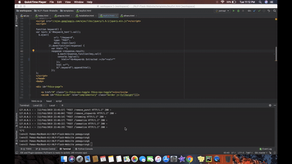

# An All-in-One Natural Language Processing (NLP) Website for Text Analysis

> **Abstract** : Natural Language Processing (NLP) has become an essential field in the era of digital information. The demand for efficient and accurate text analysis tools has surged across various domains. In response to this growing need, we propose the development of an all-in-one NLP website that offers a comprehensive suite of tools for Text Preprocessing, Keyword Extraction, Text Summarization, Named Entity Recognition, Sentiment Analysis, Language Translation, and Part-of-Speech Tagging. The website will cater to both expert NLP practitioners and non-experts, presenting a user-friendly interface that simplifies the complexity of NLP tasks. We present the objectives, features, technology stack, and timeline for the development of this platform, aiming to streamline text analysis processes and foster innovation in NLP applications.

### Deployment Steps
Please follow the below steps to run this project.
1. In the Terminal with correct path set Run: ` $ pip install -r requirements.txt `
2. Run ` $ python api.py `

### Platform, Libraries and Frameworks used
1. [Flask](https://flask.palletsprojects.com/en/3.0.x/)
2. [NLTK](https://pypi.org/project/nltk/)
3. [Sumy](https://pypi.org/project/sumy/)
4. [Auto Correct](https://pypi.org/project/autocorrect/)

# Demo of "Flask Website for NLP"

